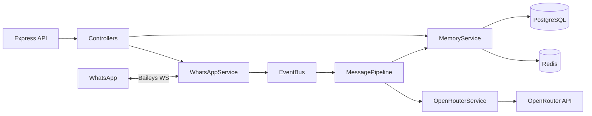

# Bailey — AI WhatsApp Assistant

Production-ready WhatsApp AI assistant built with **Baileys**, **OpenRouter**, **Express**, **PostgreSQL**, **Redis**, and **Docker**.

## Features

- WhatsApp Web connection via Baileys (QR login, session persistence, auto-reconnect)
- AI replies through OpenRouter (configurable model, system prompt, streaming, retries)
- Multi-conversation memory (PostgreSQL + Redis cache)
- Media receive: text, images, audio, PDFs, documents
- Typing indicators, read receipts, presence, quoted replies
- Secured REST API with API key auth and Redis rate limiting

## Architecture



**Message flow:** incoming WhatsApp message → download/store media → persist user message → load context (Redis, then Postgres) → stream OpenRouter reply → typing indicator → send quoted WhatsApp text → persist assistant message.

## Folder structure

```
src/
  config/       Environment validation (zod), logger, constants
  controllers/  HTTP handlers
  services/     WhatsApp, OpenRouter, message pipeline, rate limiting
  database/     Prisma + Redis clients
  middleware/   API key, validation, rate limit, errors
  events/       Typed application event bus
  memory/       Conversation context + cache
  prompts/      System prompt builder
  utils/        Retry, JID helpers, media filesystem helpers
  app.ts        Express app factory
  index.ts      Bootstrap
prisma/         Schema + migrations
```

## Prerequisites

- Node.js 20+
- Docker & Docker Compose (recommended)
- OpenRouter API key
- A phone with WhatsApp for QR linking

## Quick start (Docker)

1. Copy environment file and edit secrets:

```bash
cp .env.example .env
```

Set at least:

- `API_KEY` (16+ characters)
- `OPENROUTER_API_KEY`
- `OPENROUTER_MODEL` (optional; default `openai/gpt-4o-mini`)
- `SYSTEM_PROMPT` (optional)

2. Start the stack:

```bash
docker compose up --build
```

3. Watch logs for the QR code:

```bash
docker compose logs -f app
```

4. On your phone: **WhatsApp → Settings → Linked Devices → Link a Device**, then scan the QR.

5. Health check:

```bash
curl http://localhost:3000/health
```

Auth sessions persist in the `wa_auth` Docker volume. Media is stored in `wa_media`.

## Local development

1. Start Postgres and Redis (or use Compose for just those services):

```bash
docker compose up -d postgres redis
```

2. Install and migrate:

```bash
cp .env.example .env
# edit .env — DATABASE_URL and REDIS_URL should point at localhost
npm install
npx prisma migrate deploy
npm run dev
```

3. Scan the QR printed in the terminal.

## Baileys setup & QR authentication

- Auth credentials are stored under `AUTH_DIR` (default `./auth_info`).
- On first run (or after logout), Baileys emits a QR; it is printed via `qrcode-terminal`.
- Connection drops trigger automatic reconnect.
- `DisconnectReason.loggedOut` clears the auth directory so a fresh QR can be generated.
- Session status is mirrored in Redis at `wa:session:status`.

### Groups

By default, group and broadcast messages are ignored. Set `ALLOW_GROUPS=true` to process groups.

## Environment variables

| Variable | Description |
|---|---|
| `PORT` | HTTP port (default `3000`) |
| `API_KEY` | Required; `X-API-Key` / Bearer token for protected routes |
| `OPENROUTER_API_KEY` | OpenRouter API key |
| `OPENROUTER_MODEL` | Model id (e.g. `openai/gpt-4o-mini`, `anthropic/claude-3.5-sonnet`) |
| `OPENROUTER_BASE_URL` | Default `https://openrouter.ai/api/v1` |
| `SYSTEM_PROMPT` | System prompt for all AI replies |
| `DATABASE_URL` | PostgreSQL connection string |
| `REDIS_URL` | Redis connection string |
| `AUTH_DIR` | Baileys multi-file auth directory |
| `MEDIA_DIR` | Downloaded media storage |
| `MAX_CONTEXT_MESSAGES` | Rolling context window size |
| `REDIS_CONV_TTL_SECONDS` | Redis conversation cache TTL |
| `AI_MAX_RETRIES` / `SEND_MAX_RETRIES` | Retry budgets |
| `RATE_LIMIT_WINDOW_MS` / `RATE_LIMIT_MAX` | API rate limiting |
| `ALLOW_GROUPS` | Process WhatsApp group messages |
| `MAX_MEDIA_BYTES` | Max inbound media size |
| `LOG_LEVEL` | Pino log level |

All variables are validated at startup with Zod. Missing required secrets cause a fast exit.

## API documentation

All routes except `GET /health` require:

```http
X-API-Key: <API_KEY>
```

Rate limiting applies (Redis sliding window). Responses include `X-RateLimit-*` headers.

### `GET /health`

Public. Returns database, Redis, and WhatsApp connectivity.

```bash
curl http://localhost:3000/health
```

### `GET /users`

```bash
curl -H "X-API-Key: $API_KEY" "http://localhost:3000/users?page=1&limit=50"
```

### `GET /messages?phone=`

```bash
curl -H "X-API-Key: $API_KEY" "http://localhost:3000/messages?phone=15551234567&page=1&limit=50"
```

### `POST /send`

```bash
curl -X POST http://localhost:3000/send \
  -H "Content-Type: application/json" \
  -H "X-API-Key: $API_KEY" \
  -d '{"phone":"15551234567","message":"Hello from the API"}'
```

### `DELETE /conversation/{phone}`

Clears PostgreSQL messages for the user and Redis conversation cache.

```bash
curl -X DELETE -H "X-API-Key: $API_KEY" \
  http://localhost:3000/conversation/15551234567
```

## AI behavior

- Context = system prompt + last `MAX_CONTEXT_MESSAGES` turns
- Redis holds a hot window; Postgres is the source of truth
- OpenRouter responses are **streamed** (SSE). Tokens are accumulated while a typing indicator is shown, then sent as a single WhatsApp message (often quoted to the inbound message)
- Images are forwarded to vision-capable models as data URLs
- Audio / PDF / documents are stored on disk and described in the prompt with captions
- Failed AI and send operations use jittered exponential backoff

## Events

Internal typed events (see `src/events/eventBus.ts`):

| Event | When |
|---|---|
| `connection.open` | WhatsApp socket authenticated |
| `connection.close` | Socket disconnected |
| `qr.generated` | New QR available |
| `message.received` | Inbound user message |
| `message.sent` | Outbound message sent |
| `message.delivered` | Delivery ack |
| `message.read` | Read receipt |
| `error` | Captured operational error |

## Security notes

- Never commit `.env` or `auth_info/`
- Rotate `API_KEY` and OpenRouter keys regularly
- Logs redact authorization headers and API keys
- Request bodies are validated with Zod
- Helmet and CORS are enabled on the HTTP server

## Scripts

| Script | Purpose |
|---|---|
| `npm run dev` | TypeScript watch mode |
| `npm run build` | Compile to `dist/` |
| `npm start` | Run compiled app |
| `npm run prisma:migrate:dev` | Create/apply migrations in development |
| `npm run prisma:migrate` | Apply migrations (production) |

## Extending

- Add tools / function-calling in `src/services/openrouter.service.ts`
- Add outbound media send helpers in `src/services/whatsapp.service.ts`
- Subscribe to `eventBus` in new modules without coupling to Baileys
- Swap models by changing `OPENROUTER_MODEL` — no code change required

## License

MIT
